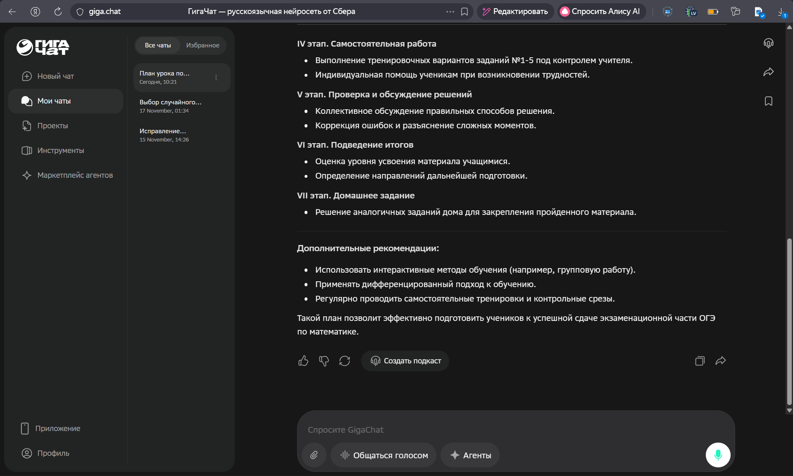
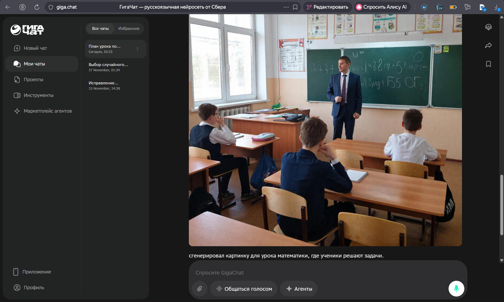
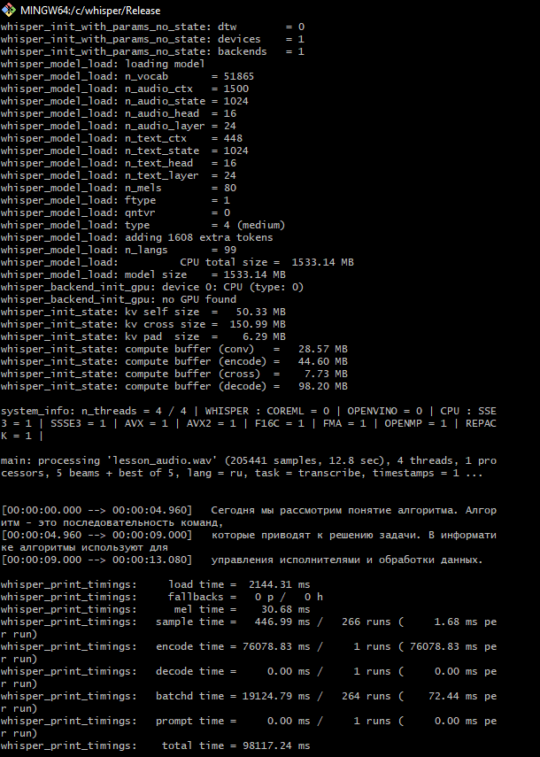

# Лабораторная работа № 1

**«Подбор инструментов искусственного интеллекта для типовых задач педагога»**

**Выполнила:** Жукова Таисия, группа 2об_ПОО/24  

---

## Задание 1. Анализ типовых задач педагога

### 1.1. Перечень типовых задач

| №  | Задача                                          | Категория             | Частота     | Трудоёмкость (1–5) |
| -- | ----------------------------------------------- | --------------------- | ----------- | ------------------ |
| 1  | Разработка плана проведения урока               | планирование          | ежедневно   | 3                  |
| 2  | Подготовка текстового конспекта занятия         | создание контента     | ежедневно   | 3                  |
| 3  | Разработка тестовых заданий                     | контроль и оценивание | еженедельно | 4                  |
| 4  | Проверка письменных работ учеников              | контроль и оценивание | ежедневно   | 5                  |
| 5  | Подготовка презентационных материалов           | визуализация          | еженедельно | 4                  |
| 6  | Поиск и подбор учебных материалов               | создание контента     | еженедельно | 3                  |
| 7  | Адаптация материалов под уровень класса         | создание контента     | еженедельно | 4                  |
| 8  | Составление домашних заданий                    | планирование          | еженедельно | 3                  |
| 9  | Предоставление обратной связи учащимся          | коммуникация          | ежедневно   | 4                  |
| 10 | Взаимодействие с родителями                     | коммуникация          | еженедельно | 3                  |
| 11 | Заполнение электронного журнала                 | документооборот       | ежедневно   | 3                  |
| 12 | Подготовка отчётных документов                  | документооборот       | ежемесячно  | 4                  |
| 13 | Анализ результатов проверочных работ            | контроль и оценивание | еженедельно | 4                  |
| 14 | Подготовка наглядных таблиц и схем              | визуализация          | еженедельно | 3                  |
| 15 | Планирование учебной нагрузки                   | административные      | ежемесячно  | 3                  |

### 1.2. Приоритизация задач

| № приоритета | Задача                                          | Потенциал автоматизации (%) |
| ------------ | ----------------------------------------------- | --------------------------- |
| 1            | Проверка письменных работ учеников              | 70                          |
| 2            | Разработка тестовых заданий                     | 80                          |
| 3            | Адаптация учебных материалов под уровень класса | 75                          |
| 4            | Анализ результатов контрольных работ            | 65                          |
| 5            | Подготовка презентаций для уроков               | 60                          |

---

## Задание 2. Подбор инструментов

### 2.1. Матрица инструментов

#### Задача 1. Проверка письменных работ учащихся

* **Отечественный:** GigaChat — https://giga.chat  
  *Плюсы:* хорошая поддержка русского языка, учитывает образовательный контекст  
  *Минусы:* требуется подключение к интернету  

* **Зарубежный бесплатный:** DeepSeek — https://chat.deepseek.com  
  *Плюсы:* хорошо анализирует тексты и аргументацию  
  *Минусы:* обработка данных происходит на зарубежных серверах  

* **Open-Source:** Ollama + LLM — https://ollama.com  
  *Плюсы:* возможность локальной работы и высокая конфиденциальность  
  *Минусы:* требуется первоначальная настройка  

#### Задача 2. Создание тестовых заданий

* **Отечественный:** YandexGPT — https://ya.ru/chat  
  *Плюсы:* корректно формулирует задания на русском языке  
  *Минусы:* отсутствует встроенный конструктор тестов  

* **Зарубежный бесплатный:** Qwen — https://qwen.ai  
  *Плюсы:* бесплатный доступ и большое контекстное окно  
  *Минусы:* не ориентирован специально на образовательные стандарты  

* **Open-Source:** LocalAI — https://github.com/mudler/LocalAI  
  *Плюсы:* совместимость с OpenAI API  
  *Минусы:* требует использования Docker  

#### Задача 3. Адаптация учебных материалов

* **Отечественный:** GigaChat  
* **Зарубежный бесплатный:** Qwen  
* **Open-Source:** LM Studio — https://lmstudio.ai  

#### Задача 4. Анализ результатов контрольных работ

* **Отечественный:** YandexGPT  
* **Зарубежный бесплатный:** DeepSeek  
* **Open-Source:** GPT4All — https://github.com/nomic-ai/gpt4all  

#### Задача 5. Подготовка презентаций

* **Отечественный:** GigaChat + Kandinsky  
* **Зарубежный бесплатный:** Gamma.app — https://gamma.app  
* **Open-Source:** Stable Diffusion WebUI — https://github.com/AUTOMATIC1111/stable-diffusion-webui  

### 2.2. Тестирование инструментов

#### Инструмент 1: GigaChat

| Параметр                 | Оценка  | Комментарий                |
| ------------------------ | ------- | -------------------------- |
| Регистрация и доступ     | 4       | Требуется регистрация, но проходит быстро |
| Интерфейс                | 5       | Понятный и удобный интерфейс |
| Качество результата      | 5       | В большинстве случаев результат сразу подходит |
| Скорость работы          | 4       | Иногда бывают небольшие задержки |
| Поддержка русского языка | 5       | Очень хорошая поддержка русского |
| **Итоговая оценка**      | **4.6** |                            |

#### Инструмент 2: Kandinsky

| Параметр                 | Оценка  | Комментарий |
| ------------------------ | ------- | ----------- |
| Регистрация и доступ     | 4       | Требуется аккаунт |
| Интерфейс                | 3       | Интерфейс понятный, но не очень удобный |
| Качество результата      | 2       | Изображения не всегда подходят для учебных материалов |
| Скорость работы          | 4       | Генерация происходит достаточно быстро |
| Поддержка русского языка | 5       | Хорошо понимает запросы на русском |
| **Итоговая оценка**      | **3.6** | |

#### Инструмент 3: Whisper (локально)

| Параметр                 | Оценка  | Комментарий |
| ------------------------ | ------- | ----------- |
| Регистрация и доступ     | 5       | Не требуется регистрация |
| Интерфейс                | 2       | Работа через командную строку может быть сложной |
| Качество результата      | 5       | Очень точное распознавание речи |
| Скорость работы          | 3       | Зависит от мощности компьютера |
| Поддержка русского языка | 5       | Хорошо распознаёт русскую речь |
| **Итоговая оценка**      | **4.0** | |

---

## Задание 3. Дополнительные возможности автоматизации

### 3.1. Неочевидные задачи

| № | Задача                     | Почему упускают       | Инструмент |
| - | -------------------------- | --------------------- | ---------- |
| 1 | Генерация идей для проектов| Считается творческой  | GigaChat   |
| 2 | Адаптация текстов          | Требует много времени | Qwen       |
| 3 | Создание субтитров к видео | Техническая сложность | Whisper    |
| 4 | Индивидуальные комментарии | Персонализация        | YandexGPT  |
| 5 | Создание глоссариев        | Нет системного подхода| DeepSeek   |
| 6 | Материалы для ОВЗ          | Нужен опыт адаптации  | GigaChat   |
| 7 | Анализ распространённых ошибок | Обычно делается вручную | GPT4All |
| 8 | Вопросы для рефлексии      | Часто считается второстепенным | GigaChat |

### 3.2. Ручная цепочка инструментов

**Цепочка: создание адаптивных учебных материалов**

1. Подготовка исходного текста (вручную)  
2. Адаптация под разные уровни — GigaChat / Qwen  
3. Пояснение терминов — DeepSeek  
4. Создание схем — GigaChat (Mermaid)  
5. Финальная проверка — преподаватель  

---

## Задание 4. Сравнительный анализ

### 4.1. Сравнение языковых моделей

| Критерий                | GigaChat  | YandexGPT    | DeepSeek  | Qwen      |
| ----------------------- | --------- | ------------ | --------- | --------- |
| Качество русского языка | высокое   | высокое      | среднее   | высокое   |
| Скорость                | высокая   | высокая      | высокая   | средняя   |
| Контекстное окно        | большое   | большое      | большое   | большое   |
| Работа с кодом          | средняя   | средняя      | высокая   | средняя   |
| Мультимодальность       | да        | да           | нет       | да        |
| Доступность в РФ        | полная    | полная       | полная    | полная    |
| Стоимость               | бесплатно | бесплатно    | бесплатно | бесплатно |
| API                     | да        | да           | да        | да        |
| Рекомендация            | основной  | альтернатива | анализ    | адаптация |

### 4.2. Выводы

1. Отечественные модели лучше адаптированы для использования в образовательной сфере.  
2. Зарубежные бесплатные инструменты удобно применять для анализа и генерации идей.  
3. GigaChat можно рассматривать как универсального помощника для преподавателя.  
4. Совместное использование нескольких ИИ-инструментов позволяет значительно повысить эффективность работы.  
5. При выборе инструментов важно учитывать безопасность данных и доступность сервисов.

---

## Итоговый набор инструментов

Для повседневной педагогической деятельности можно рекомендовать следующий набор инструментов:

* **GigaChat** — основной ИИ-ассистент  
* **YandexGPT** — генерация заданий и анализ текстов  
* **Kandinsky** — создание визуальных материалов  
* **Whisper (локально)** — работа с аудио и видео
